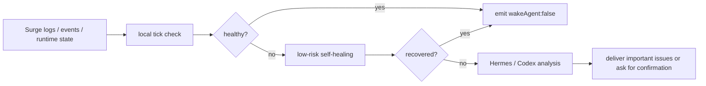

# Surge Guardian Assistant

[简体中文](https://github.com/rexchen2024/surge-guardian-assistant/blob/main/README.md) | [繁體中文](https://github.com/rexchen2024/surge-guardian-assistant/blob/main/README.zh-TW.md)

A quiet monitoring and self-healing assistant for Surge users. It uses Surge's official runtime capabilities and `surge-cli` to check logs, events, policies, and external resources. Healthy checks stay silent; incidents are handled with low-risk actions first; only important cases are handed to Hermes, Codex, or chat delivery.

**Current version: 0.1.0**

This project is still in early testing. Trial use and feedback are welcome, and future updates will continue to follow real-world usage.

## Contents

- [Highlights](#highlights)
- [How It Works](#how-it-works)
- [Install Options](#install-options)
- [Docs](#docs)
- [Project Info](#project-info)
- [My Recommendation](#my-recommendation)

---

## Highlights

- **Quiet and low-power**: healthy checks emit only `{"wakeAgent": false}`; routine work stays on local scripts and Surge runtime APIs where possible.
- **Native Surge checks**: reads events, retests policies, flushes DNS, updates external resources, and adds temporary runtime rules.
- **Safe self-healing first**: low-risk issues are handled first; actions stay narrow, runtime-only, and reversible where possible. Permanent config, certificates, DNS records, servers, MITM, Rewrite, Scripting, reload, or restart require confirmation.
- **AI only when useful**: repeated, complex, or unresolved incidents can be reviewed by Hermes or Codex.
- **Learns through Hermes**: Hermes Edition can use Hermes memory and skills to turn repeated incidents into future handling experience.
- **Automatic updates and privacy-first defaults**: installed copies can pull updates from GitHub; local tracked edits are not overwritten; logs and usage data are not uploaded automatically.

---

## How It Works

---

## Install Options

**1. Terminal**

For users who only want to check Surge from the local terminal. This is the lightest path: the script calls `surge-cli` directly and can be run manually or by a local scheduler.

[One-command install and local run notes](docs/runtime-options.md)

**2. 🌟 Recommended - Hermes Agent**

Best for always-on monitoring, incident notifications, and learning from repeated patterns. Healthy checks stay fully silent; important issues can wake AI and notify you through chat.

[One-command install and Hermes task setup](docs/hermes-edition.md)

**3. Codex**

Best for lower-frequency repository checks, incident review, and project maintenance. It is not recommended for minute-level monitoring.

[One-command install and Codex automation setup](docs/codex-edition.md)

The scripts call Surge's `surge-cli` directly. Installation, automatic updates, schedule frequency, and safety boundaries are covered in the linked docs.

---

## Docs

- [Hermes Edition](docs/hermes-edition.md)
- [Codex Edition](docs/codex-edition.md)
- [Runtime options](docs/runtime-options.md)
- [Updating](docs/updating.md)
- [Autonomy model](docs/autonomy.md)
- [Troubleshooting](docs/troubleshooting.md)
- [FAQ](docs/faq.md)
- [Privacy notes](docs/privacy.md)
- [Changelog](CHANGELOG.md)

---

## Project Info

- License: [MIT](LICENSE)
- Contributing: [CONTRIBUTING.md](CONTRIBUTING.md)
- Security policy: [SECURITY.md](SECURITY.md)
- Code of conduct: [CODE_OF_CONDUCT.md](CODE_OF_CONDUCT.md)

---

## My Recommendation

 [CMYNetwork](https://cmy.homes/register?aff=4MMK4C): a proxy provider I have used for years; highly available even during sensitive periods, and friendly to Clash rule setups.
