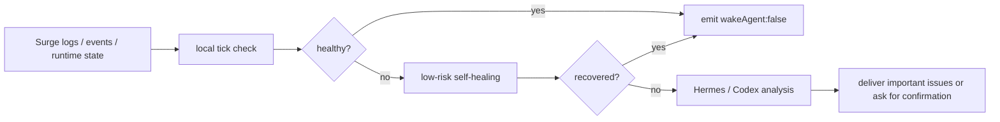

# Surge Guardian Assistant

[](https://github.com/rexchen2024/surge-guardian-assistant/releases)
[](LICENSE)

[简体中文](https://github.com/rexchen2024/surge-guardian-assistant/blob/main/README.md) | [繁體中文（香港）](https://github.com/rexchen2024/surge-guardian-assistant/blob/main/README.zh-HK.md) | [繁體中文（台灣）](https://github.com/rexchen2024/surge-guardian-assistant/blob/main/README.zh-TW.md)

Surge Guardian Assistant is a quiet monitoring and self-healing tool for Surge users. It uses Surge's official Agent Skill / `surge-cli` runtime capabilities to watch logs, events, policies, and external resources. Healthy checks stay silent; incidents are handled with low-risk actions first; only important cases are handed to Hermes, Codex, or chat delivery.

**Current version: 0.1.0**

## Highlights

- **Extremely quiet by default**: healthy runs emit only `{"wakeAgent": false}`.
- **Low-power monitoring**: routine checks use local scripts and Surge runtime interfaces, avoiding minute-level AI calls.
- **Native Surge capabilities**: reads events, retests policies, flushes DNS, updates external resources, and adds temporary runtime rules.
- **Self-healing before escalation**: low-risk issues are handled first; permanent config changes require confirmation.
- **AI only when useful**: repeated, complex, or unresolved incidents can be reviewed by Hermes or Codex.
- **Chat only for important issues**: Hermes can deliver through Telegram, Discord, Matrix, Weixin, Feishu, Signal, and other channels while healthy checks remain silent.
- **Learns through Hermes**: Hermes Edition can use Hermes memory and skills to turn repeated incidents into future handling experience.
- **Automatic updates**: installed copies can pull updates from GitHub without overwriting local tracked edits.
- **Privacy-first**: `.env`, state files, and feedback reports stay local with private permissions; no automatic log or usage upload.

## Good Fit

- You already use Surge and want continuous checks for logs, events, and policy state.
- You want healthy runs to stay fully silent and real incidents to produce a clear summary.
- You want external-resource failures, DNS errors, policy issues, and repeated DIRECT failures handled before escalation.
- You want Hermes for always-on monitoring or Codex for lower-frequency maintenance and incident review.

## Project Boundary

This project itself is not a Surge profile library, rule set, module collection, or proxy provider recommendation. It adds monitoring, self-healing, and incident feedback on top of an existing Surge setup.

Automatic actions are intentionally narrow, runtime-only, and reversible where possible. Permanent profile changes, certificates, DNS, MITM, Rewrite, Scripting, policy-group selection, reload, or restart actions should happen only after user confirmation.

## How It Works



## Requirements

- Surge is installed and running on macOS.
- Git is available.
- Python 3.10 or newer.
- If you choose Hermes Edition, install Hermes first; it handles scheduling, AI analysis, and message delivery.
- If you choose Codex Edition, Codex needs access to the local repository; it is for lower-frequency maintenance, not minute-level monitoring.

## One-Command Install

Default install path: `~/.surge-guardian-assistant`

```bash
bash -c "$(curl -fsSL https://raw.githubusercontent.com/rexchen2024/surge-guardian-assistant/main/install.sh)" -- --setup
```

If the repository is still private, use Git:

```bash
git clone https://github.com/rexchen2024/surge-guardian-assistant.git ~/.surge-guardian-assistant
cd ~/.surge-guardian-assistant
scripts/surge-guardian-assistant setup --print-hermes-command
```

Prompt for Hermes:

```text
Install Surge Guardian Assistant from https://github.com/rexchen2024/surge-guardian-assistant, run setup, and show me the generated Hermes cron command. Do not edit Surge profiles or make permanent network changes without asking me first.
```

Prompt for Codex:

```text
Install https://github.com/rexchen2024/surge-guardian-assistant locally as my Surge Guardian Assistant project, run doctor and scripts/check, then create or suggest a safe Codex automation. Do not edit Surge profiles without asking me first.
```

## Editions

**Hermes Edition** is recommended for always-on monitoring. Healthy runs stay silent; important incidents can be delivered through Hermes.

[Install Hermes Edition](docs/hermes-edition.md)

**Codex Edition** is optional. It is useful for daily or weekly repository checks, incident review, and project maintenance.

[Install Codex Edition](docs/codex-edition.md)

## Automatic Updates

Automatic updates work when the install path is a Git checkout and Hermes, Codex, or another scheduler keeps running `tick`.

If new code is available, the assistant pulls it and runs `scripts/check`. If local tracked files were changed, it skips the update instead of overwriting anything.

```bash
cd ~/.surge-guardian-assistant
scripts/surge-guardian-assistant update --check
scripts/surge-guardian-assistant update
```

Turn off automatic updates in `.env`:

```bash
AUTO_UPDATE=0
```

## Useful Commands

```bash
scripts/surge-guardian-assistant doctor
scripts/surge-guardian-assistant tick
scripts/surge-guardian-assistant version
scripts/surge-guardian-assistant update
scripts/surge-guardian-assistant feedback
scripts/surge-guardian-assistant redact-check
```

## Docs

- [Hermes Edition](docs/hermes-edition.md)
- [Codex Edition](docs/codex-edition.md)
- [Updating](docs/updating.md)
- [Autonomy model](docs/autonomy.md)
- [Troubleshooting](docs/troubleshooting.md)
- [FAQ](docs/faq.md)
- [Privacy notes](docs/privacy.md)
- [Changelog](CHANGELOG.md)

## Project Rules

- License: [MIT](LICENSE)
- Contributing: [CONTRIBUTING.md](CONTRIBUTING.md)
- Security policy: [SECURITY.md](SECURITY.md)

## My Recommended Proxy Provider

[Hongmei Network](https://cmy.homes/register?aff=4MMK4C)
