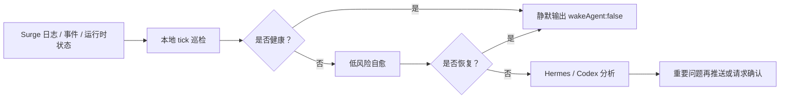

# Surge Sentry

[繁體中文](https://github.com/rexchen2024/surge-guardian-assistant/blob/main/README.zh-TW.md) | [English](https://github.com/rexchen2024/surge-guardian-assistant/blob/main/README.en.md)

Surge Assistant 大框架下的 Cron 守护分支，面向 Surge 用户做静默巡检和自愈。它基于 Surge 官方运行时能力和 `surge-cli`，持续检查启动情况、日志、事件、策略、配置同步和流量风险；健康时不打扰，异常时先自愈，只有重要问题才交给 Hermes、Codex 或聊天工具继续处理。

**当前版本：0.2.0**

本项目仍在初期测试阶段，欢迎试用并提供反馈建议。后续会根据实际使用体验持续更新。

## 目录

- [亮点](#亮点)
- [工作方式](#工作方式)
- [安装方式](#安装方式)
- [文档](#文档)
- [项目资料](#项目资料)
- [我的推荐](#我的推荐)

---

## 亮点

- **极致静默、低功耗**：健康巡检只输出 `{"wakeAgent": false}`，日常路径走本地脚本和 Surge 运行时接口，尽量不启动 AI。
- **Surge 原生巡检**：读取事件、复测策略、刷新 DNS、更新外部资源、添加运行时临时规则。
- **赛事/观影流量监控**：可以让 Sentry 盯一场 F1、世界杯 Fox 直播或 Apple TV 观影，从开始、进行中到结束输出清晰的实际流量报告。
- **真实播放 CDN 健康监控**：空闲低频、播放时高频地增量采样 Surge 活跃请求，用真实媒体吞吐识别“连接成功但持续很慢”；脚本可先直接通知，陌生问题才唤醒模型。
- **安全自愈优先**：低风险问题先自动处理；动作尽量小范围、运行时、可回退；永久配置、证书、DNS 记录、服务器、MITM、Rewrite、Scripting、重载或重启都需要确认。
- **任选 Hermes 或 Codex**：Hermes 路线适合常驻守护、低噪声通知和后台沉淀；Codex 路线适合开源用户做安装检查、Surge 配置诊断、异常复盘、文档维护和安全变更协作。
- **必要时再用 AI**：重复、复杂或未恢复的问题才交给 Hermes/Codex；重要问题再通过聊天工具推送。
- **自动更新、隐私优先**：可从 GitHub 拉取新版本；本地有改动不覆盖；不自动上传日志或使用数据。

---

## 工作方式

---

## 安装方式

**1. 终端**

只想在本机终端检查 Surge。最轻量，脚本直接调用 `surge-cli`，适合手动检查或本地调度。

[一键安装和本地运行说明](docs/runtime-options.zh-CN.md)

**2. Hermes Agent**

适合想要常驻后台守护的人。健康时完全静默，重要问题再唤醒 AI，也可以通过聊天工具推送。

[一键安装和 Hermes 任务说明](docs/hermes-edition.zh-CN.md)

**3. Codex**

适合想用开源项目和本地工作区管理 Surge Sentry 的人。Codex 擅长安装检查、Surge 配置诊断、流量监控解读、异常复盘、隐私检查、文档维护和安全改动建议；健康巡检仍走本地脚本，避免每次检查都启动模型任务。

[一键安装和 Codex 自动化说明](docs/codex-edition.zh-CN.md)

脚本直接调用 Surge 的 `surge-cli`。一键安装、自动更新、任务频率和安全边界，都在对应说明里。

---

## 文档

- [Hermes 版本](docs/hermes-edition.zh-CN.md)
- [Codex 版本](docs/codex-edition.zh-CN.md)
- [运行方式](docs/runtime-options.zh-CN.md)
- [升级](docs/updating.zh-CN.md)
- [自治模型](docs/autonomy.zh-CN.md)
- [故障排查](docs/troubleshooting.zh-CN.md)
- [常见问题](docs/faq.zh-CN.md)
- [隐私说明](docs/privacy.zh-CN.md)
- [更新日志](CHANGELOG.zh-CN.md)

---

## 项目资料

- 许可证：[MIT](LICENSE)
- 贡献说明：[CONTRIBUTING.md](CONTRIBUTING.md)
- 安全策略：[SECURITY.md](SECURITY.md)
- 行为准则：[CODE_OF_CONDUCT.md](CODE_OF_CONDUCT.md)

---

## 我的推荐

 [红莓网络](https://cmy.homes/register?aff=4MMK4C)：用了多年的机场，即便是在特殊时期也高度可用，对 Clash 规则友好。
