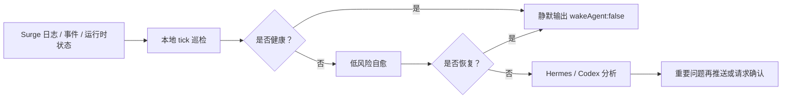

# Surge 守护助手

[](https://github.com/rexchen2024/surge-guardian-assistant/releases)
[](LICENSE)

[繁體中文（香港）](https://github.com/rexchen2024/surge-guardian-assistant/blob/main/README.zh-HK.md) | [繁體中文（台灣）](https://github.com/rexchen2024/surge-guardian-assistant/blob/main/README.zh-TW.md) | [English](https://github.com/rexchen2024/surge-guardian-assistant/blob/main/README.en.md)

Surge 守护助手是一个面向 Surge 用户的静默巡检和自愈工具。它利用 Surge 官方 Agent Skill / `surge-cli` 的运行时能力，持续检查日志、事件、策略和外部资源；健康时不打扰，异常时先做低风险处理，只有重要问题才交给 Hermes、Codex 或聊天工具继续分析。

**当前版本：0.1.0**

## 亮点

- **极致静默**：健康巡检只输出 `{"wakeAgent": false}`，不唤醒模型，不制造通知。
- **低功耗巡检**：日常检查走本地脚本和 Surge 运行时接口，尽量避免每分钟启动 AI。
- **Surge 原生能力**：读取事件、复测策略、刷新 DNS、更新外部资源、添加运行时临时规则。
- **安全自愈优先**：能自动处理的低风险问题先处理，永久配置变更必须确认。
- **必要时再用 AI**：重复、复杂或未恢复的问题才交给 Hermes/Codex 分析。
- **聊天工具只收重要问题**：通过 Hermes 投递到 Telegram、Discord、Matrix、微信、飞书、Signal 等渠道时，健康状态保持静默。
- **可持续学习**：Hermes 版本可利用 Hermes 的记忆和技能机制，把重复问题沉淀成后续处理经验。
- **自动更新**：安装后可从 GitHub 拉取新版本，本地有改动时不会覆盖。
- **隐私优先**：`.env`、state、反馈报告使用本地私有权限，不自动上传日志或使用数据。

## 适合谁

- 已经在用 Surge，希望有人持续检查日志、事件和策略状态。
- 希望健康时完全静默，异常时再收到明确摘要。
- 希望外部资源失败、DNS 异常、策略波动、DIRECT 反复失败这类问题能先自动处理。
- 希望用 Hermes 做常驻巡检，或用 Codex 做低频维护和异常复盘。

## 项目边界

本项目主体不是 Surge 配置库、规则集、模块合集或机场推荐。它只在你已有 Surge 配置的基础上做巡检、自愈和异常反馈。

所有自动处理都尽量保持小范围、运行时、可回退。涉及永久配置、证书、DNS、MITM、Rewrite、Scripting、策略组选择、重载或重启的操作，都应该由用户确认后再执行。

## 工作方式



## 要求

- macOS 上已安装并运行 Surge。
- 本机可使用 Git。
- Python 3.10 或更新版本。
- 如选择 Hermes 版本，需要先安装 Hermes；它负责定时运行、AI 分析和消息通知。
- 如选择 Codex 版本，需要 Codex 能访问本地仓库；它适合低频维护，不建议做每分钟巡检。

## 一键安装

默认装到 `~/.surge-guardian-assistant`：

```bash
bash -c "$(curl -fsSL https://raw.githubusercontent.com/rexchen2024/surge-guardian-assistant/main/install.sh)" -- --setup
```

如果仓库暂时还是私有的，用 Git：

```bash
git clone https://github.com/rexchen2024/surge-guardian-assistant.git ~/.surge-guardian-assistant
cd ~/.surge-guardian-assistant
scripts/surge-guardian-assistant setup --print-hermes-command
```

也可以把下面的内容复制给 Hermes：

```text
请从 https://github.com/rexchen2024/surge-guardian-assistant 安装 Surge 守护助手，运行 setup，显示生成的 Hermes cron 命令。不要在未确认前编辑 Surge profile 或执行永久网络变更。
```

复制给 Codex：

```text
请把 https://github.com/rexchen2024/surge-guardian-assistant 作为 Surge 守护助手项目安装到本地，运行 doctor 和 scripts/check，帮我创建或建议一个安全的 Codex 自动化。不要在未确认前编辑 Surge profile。
```

## 版本选择

**Hermes 版本**：推荐。适合常驻巡检，健康时不唤醒模型，出现重要异常再通知。

[Hermes 版本安装说明](docs/hermes-edition.zh-CN.md)

**Codex 版本**：可选。适合每天或每周检查仓库、分析异常包、持续改进项目。

[Codex 版本安装说明](docs/codex-edition.zh-CN.md)

## 自动更新

只要安装目录是 Git 仓库，并且 Hermes/Codex/系统任务还在运行 `tick`，它会默认每天检查一次 GitHub 更新。

有新代码时会自动拉取并运行 `scripts/check`。如果用户改过受 Git 管理的文件，会跳过更新，不会覆盖。

```bash
cd ~/.surge-guardian-assistant
scripts/surge-guardian-assistant update --check
scripts/surge-guardian-assistant update
```

不想自动更新，在 `.env` 里写：

```bash
AUTO_UPDATE=0
```

## 常用命令

```bash
scripts/surge-guardian-assistant doctor
scripts/surge-guardian-assistant tick
scripts/surge-guardian-assistant version
scripts/surge-guardian-assistant update
scripts/surge-guardian-assistant feedback
scripts/surge-guardian-assistant redact-check
```

## 文档

- [Hermes 版本](docs/hermes-edition.zh-CN.md)
- [Codex 版本](docs/codex-edition.zh-CN.md)
- [升级](docs/updating.zh-CN.md)
- [自治模型](docs/autonomy.zh-CN.md)
- [故障排查](docs/troubleshooting.zh-CN.md)
- [常见问题](docs/faq.zh-CN.md)
- [隐私说明](docs/privacy.zh-CN.md)
- [更新日志](CHANGELOG.zh-CN.md)

## 项目规则

- 许可证：[MIT](LICENSE)
- 贡献说明：[CONTRIBUTING.md](CONTRIBUTING.md)
- 安全策略：[SECURITY.md](SECURITY.md)

## 我推荐的机场

[红莓网络](https://cmy.homes/register?aff=4MMK4C)
