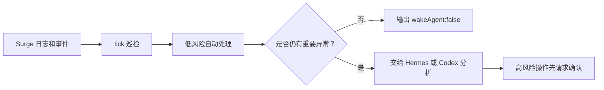

# Surge 守护助手

[](https://github.com/rexchen2024/surge-guardian-assistant/releases)
[](LICENSE)

[English](https://github.com/rexchen2024/surge-guardian-assistant/blob/main/README.md) | [简体中文](https://github.com/rexchen2024/surge-guardian-assistant/blob/main/README.zh-CN.md)

当前版本：**0.1.0**

Surge 守护助手用于持续检查 Surge 状态。正常时保持静默；发现异常时先执行安全修复；需要高风险操作时再请求确认。

项目地址：

```text
https://github.com/rexchen2024/surge-guardian-assistant
```

## 相关项目

- [Surge](https://nssurge.com/)：macOS / iOS 网络和代理工具。本项目负责检查和守护 Surge。
- [Hermes](https://github.com/NousResearch/hermes-agent)：定时运行、异常分析和消息通知层。推荐用于常驻巡检。
- [Codex](https://openai.com/codex/)：OpenAI 的代码助手。适合低频检查、异常复盘和仓库维护。

## 要求

- macOS 上已安装并运行 Surge。
- 本机可使用 Git。
- Python 3.10 或更新版本。
- Hermes 版本需要已安装 Hermes。
- Codex 版本需要 Codex 能访问本地仓库。

## 工作方式



守护助手只做低风险、可回退的处理，例如重试外部资源、刷新 DNS、复测策略、添加运行时临时规则。永久修改 Surge profile、重启服务、证书、DNS、MITM、Rewrite、Scripting 等操作都需要用户确认。

## 一键安装

默认装到 `~/.surge-guardian-assistant`：

```bash
bash -c "$(curl -fsSL https://raw.githubusercontent.com/rexchen2024/surge-guardian-assistant/main/install.sh)" -- --setup
```

如果仓库暂时还是私有的，用 Git：

```bash
git clone https://github.com/rexchen2024/surge-guardian-assistant.git ~/.surge-guardian-assistant
cd ~/.surge-guardian-assistant
scripts/surge-guardian-assistant setup --print-hermes-command
```

也可以把下面的内容复制给 Hermes：

```text
请从 https://github.com/rexchen2024/surge-guardian-assistant 安装 Surge 守护助手，运行 setup，显示生成的 Hermes cron 命令。不要在未确认前编辑 Surge profile 或执行永久网络变更。
```

复制给 Codex：

```text
请把 https://github.com/rexchen2024/surge-guardian-assistant 作为 Surge 守护助手项目安装到本地，运行 doctor 和 scripts/check，帮我创建或建议一个安全的 Codex 自动化。不要在未确认前编辑 Surge profile。
```

## 选哪个版本

**Hermes 版本**：推荐。适合每分钟巡检，健康时不唤醒模型，出现异常再通知。

[Hermes 版本安装说明](docs/hermes-edition.zh-CN.md)

**Codex 版本**：可选。适合每天或每周检查仓库、分析异常包、持续改进项目。

[Codex 版本安装说明](docs/codex-edition.zh-CN.md)

## 核心功能

- 读取 Surge 日志和事件。
- 外部资源失败时自动重试。
- DNS 连续异常时刷新 DNS。
- 通知你之前先复测策略。
- 对反复 DIRECT 失败加小范围临时规则。
- 健康时输出 `{"wakeAgent": false}`，避免无意义打扰。
- 自动从 GitHub 拉取更新。
- 本地 `.env` 和 state 文件使用私有权限。
- 提供隐私扫描和脱敏反馈报告。
- 不会擅自改永久 Surge 配置。

## 自动更新

只要安装目录是 Git 仓库，并且 Hermes/Codex/系统任务还在运行 `tick`，它会默认每天检查一次 GitHub 更新。

有新代码时会自动拉取并运行 `scripts/check`。如果用户改过受 Git 管理的文件，会跳过更新，不会覆盖。

手动检查：

```bash
cd ~/.surge-guardian-assistant
scripts/surge-guardian-assistant update --check
```

手动更新：

```bash
scripts/surge-guardian-assistant update
```

不想自动更新，在 `.env` 里写：

```bash
AUTO_UPDATE=0
```

## 反馈问题

项目不会自动上传日志或使用数据。用户可以主动生成脱敏报告，检查后再决定是否提交：

```bash
scripts/surge-guardian-assistant feedback --github-url
```

想先在终端查看：

```bash
scripts/surge-guardian-assistant feedback --print
```

## 常用命令

```bash
scripts/surge-guardian-assistant doctor
scripts/surge-guardian-assistant tick
scripts/surge-guardian-assistant version
scripts/surge-guardian-assistant update
scripts/surge-guardian-assistant feedback
scripts/surge-guardian-assistant redact-check
```

## 文档

- [Hermes 版本](docs/hermes-edition.zh-CN.md)
- [Codex 版本](docs/codex-edition.zh-CN.md)
- [升级](docs/updating.zh-CN.md)
- [自治模型](docs/autonomy.zh-CN.md)
- [故障排查](docs/troubleshooting.zh-CN.md)
- [隐私说明](docs/privacy.zh-CN.md)
- [更新日志](CHANGELOG.zh-CN.md)

## 项目规则

- 许可证：[MIT](LICENSE)
- 贡献说明：[CONTRIBUTING.md](CONTRIBUTING.md)
- 安全策略：[SECURITY.md](SECURITY.md)
