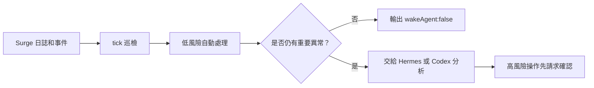

# Surge 守護助手

[](https://github.com/rexchen2024/surge-guardian-assistant/releases)
[](LICENSE)

[简体中文](https://github.com/rexchen2024/surge-guardian-assistant/blob/main/README.md) | [繁體中文（香港）](https://github.com/rexchen2024/surge-guardian-assistant/blob/main/README.zh-HK.md) | [繁體中文（台灣）](https://github.com/rexchen2024/surge-guardian-assistant/blob/main/README.zh-TW.md) | [English](https://github.com/rexchen2024/surge-guardian-assistant/blob/main/README.en.md)

目前版本：**0.1.0**

Surge 守護助手用於持續檢查 Surge 狀態。正常時保持安靜；發現異常時先執行安全修復；需要高風險操作時再請你確認。

項目地址：

```text
https://github.com/rexchen2024/surge-guardian-assistant
```

## 相關項目

- [Surge](https://nssurge.com/)：macOS / iOS 網絡及代理工具。本項目負責檢查和守護 Surge。
- [Hermes](https://github.com/NousResearch/hermes-agent)：定時執行、異常分析和訊息通知層。建議用於常駐巡檢。
- [Codex](https://openai.com/codex/)：OpenAI 的程式碼助手。適合低頻檢查、異常覆盤和項目維護。

## 要求

- macOS 已安裝並正在運行 Surge。
- 本機可使用 Git。
- Python 3.10 或更新版本。
- Hermes 版本需要已安裝 Hermes。
- Codex 版本需要 Codex 可存取本地儲存庫。

## 適合誰

- 已經在用 Surge，並希望有人持續檢查日誌、事件和策略狀態。
- 希望健康時保持安靜，異常時再收到清晰摘要。
- 希望低風險問題先自動處理，例如外部資源重試、DNS 刷新、策略複測。
- 希望透過 Hermes 做常駐巡檢，或透過 Codex 做低頻維護。

## 不適合誰

- 只想找 Surge 配置、模組、規則集或訂閱連結。
- 希望工具自動修改永久 Surge profile。
- 希望把所有網絡問題都交給模型判斷。
- 不希望安裝 Git 或在本機執行腳本。

## 工作方式



守護助手只做低風險、可回退的處理，例如重試外部資源、刷新 DNS、複測策略、加入運行時臨時規則。永久修改 Surge profile、重啟服務、證書、DNS、MITM、Rewrite、Scripting 等操作都需要用戶確認。

## 項目邊界

本項目不是 Surge 配置庫、規則集、模組合集或機場推薦。它只負責在你已有 Surge 配置的基礎上做巡檢、自愈和異常回饋。

所有自動處理都盡量保持小範圍、運行時、可回退。涉及永久配置、證書、DNS、MITM、Rewrite、Scripting、策略組選擇、重載或重啟的操作，都應該由用戶確認後再執行。

## 一鍵安裝

預設安裝到 `~/.surge-guardian-assistant`：

```bash
bash -c "$(curl -fsSL https://raw.githubusercontent.com/rexchen2024/surge-guardian-assistant/main/install.sh)" -- --setup
```

如果儲存庫暫時仍是私有，請使用 Git：

```bash
git clone https://github.com/rexchen2024/surge-guardian-assistant.git ~/.surge-guardian-assistant
cd ~/.surge-guardian-assistant
scripts/surge-guardian-assistant setup --print-hermes-command
```

也可以把以下內容複製給 Hermes：

```text
請從 https://github.com/rexchen2024/surge-guardian-assistant 安裝 Surge 守護助手，執行 setup，顯示產生的 Hermes cron 命令。未經我確認前，不要編輯 Surge profile 或執行永久網絡變更。
```

複製給 Codex：

```text
請把 https://github.com/rexchen2024/surge-guardian-assistant 作為 Surge 守護助手項目安裝到本機，執行 doctor 和 scripts/check，幫我建立或建議一個安全的 Codex 自動化。未經我確認前，不要編輯 Surge profile。
```

## 選哪個版本

**Hermes 版本**：推薦。適合每分鐘巡檢，健康時不喚醒模型，出現異常再通知。

[Hermes 版本安裝說明](docs/hermes-edition.zh-CN.md)

**Codex 版本**：可選。適合每天或每週檢查儲存庫、分析異常包、持續改進項目。

[Codex 版本安裝說明](docs/codex-edition.zh-CN.md)

## 核心功能

- 讀取 Surge 日誌和事件。
- 外部資源失敗時自動重試。
- DNS 連續異常時刷新 DNS。
- 通知你之前先複測策略。
- 對反覆 DIRECT 失敗加入小範圍臨時規則。
- 健康時輸出 `{"wakeAgent": false}`，避免無意義打擾。
- 自動從 GitHub 拉取更新。
- 本地 `.env` 和 state 檔案使用私有權限。
- 提供私隱掃描和脫敏回饋報告。
- 不會擅自修改永久 Surge 配置。

## 自動更新

只要安裝目錄是 Git 儲存庫，而且 Hermes/Codex/系統任務仍在執行 `tick`，它預設每天檢查一次 GitHub 更新。

有新程式碼時會自動拉取並執行 `scripts/check`。如果用戶改過受 Git 管理的檔案，會跳過更新，不會覆蓋。

手動檢查：

```bash
cd ~/.surge-guardian-assistant
scripts/surge-guardian-assistant update --check
```

手動更新：

```bash
scripts/surge-guardian-assistant update
```

不想自動更新，在 `.env` 裏寫：

```bash
AUTO_UPDATE=0
```

## 回饋問題

項目不會自動上傳日誌或使用數據。用戶可以主動產生脫敏報告，檢查後再決定是否提交：

```bash
scripts/surge-guardian-assistant feedback --github-url
```

想先在終端查看：

```bash
scripts/surge-guardian-assistant feedback --print
```

## 常用命令

```bash
scripts/surge-guardian-assistant doctor
scripts/surge-guardian-assistant tick
scripts/surge-guardian-assistant version
scripts/surge-guardian-assistant update
scripts/surge-guardian-assistant feedback
scripts/surge-guardian-assistant redact-check
```

## 文件

- [Hermes 版本](docs/hermes-edition.zh-CN.md)
- [Codex 版本](docs/codex-edition.zh-CN.md)
- [升級](docs/updating.zh-CN.md)
- [自治模型](docs/autonomy.zh-CN.md)
- [故障排查](docs/troubleshooting.zh-CN.md)
- [常見問題](docs/faq.zh-CN.md)
- [私隱說明](docs/privacy.zh-CN.md)
- [更新日誌](CHANGELOG.zh-CN.md)

## 項目規則

- 授權條款：[MIT](LICENSE)
- 貢獻說明：[CONTRIBUTING.md](CONTRIBUTING.md)
- 安全策略：[SECURITY.md](SECURITY.md)
