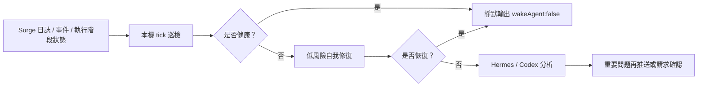

# Surge 守護助手

[](https://github.com/rexchen2024/surge-guardian-assistant/releases)
[](LICENSE)

[简体中文](https://github.com/rexchen2024/surge-guardian-assistant/blob/main/README.md) | [繁體中文（香港）](https://github.com/rexchen2024/surge-guardian-assistant/blob/main/README.zh-HK.md) | [English](https://github.com/rexchen2024/surge-guardian-assistant/blob/main/README.en.md)

Surge 守護助手是面向 Surge 使用者的靜默巡檢和自我修復工具。它利用 Surge 官方 Agent Skill / `surge-cli` 的執行階段能力，持續檢查日誌、事件、策略和外部資源；健康時不打擾，異常時先做低風險處理，只有重要問題才交給 Hermes、Codex 或聊天工具繼續分析。

**目前版本：0.1.0**

## 亮點

- **極致靜默**：健康巡檢只輸出 `{"wakeAgent": false}`，不喚醒模型，不製造通知。
- **低功耗巡檢**：日常檢查走本機腳本和 Surge 執行階段介面，盡量避免每分鐘啟動 AI。
- **Surge 原生能力**：讀取事件、複測策略、刷新 DNS、更新外部資源、加入執行階段臨時規則。
- **安全自我修復優先**：能自動處理的低風險問題先處理，永久設定變更必須確認。
- **必要時再用 AI**：重複、複雜或未恢復的問題才交給 Hermes/Codex 分析。
- **聊天工具只收重要問題**：透過 Hermes 投遞到 Telegram、Discord、Matrix、微信、飛書、Signal 等管道時，健康狀態保持靜默。
- **可持續學習**：Hermes 版本可利用 Hermes 的記憶和技能機制，把重複問題沉澱成後續處理經驗。
- **自動更新**：安裝後可從 GitHub 拉取新版本，本機有改動時不會覆蓋。
- **隱私優先**：`.env`、state、回饋報告使用本機私有權限，不自動上傳日誌或使用資料。

## 適合誰

- 已經在用 Surge，希望有人持續檢查日誌、事件和策略狀態。
- 希望健康時完全靜默，異常時再收到清楚摘要。
- 希望外部資源失敗、DNS 異常、策略波動、DIRECT 反覆失敗這類問題能先自動處理。
- 希望用 Hermes 做常駐巡檢，或用 Codex 做低頻維護和異常回顧。

## 專案邊界

本專案主體不是 Surge 設定庫、規則集、模組合集或機場推薦。它只在你已有 Surge 設定的基礎上做巡檢、自我修復和異常回饋。

所有自動處理都盡量保持小範圍、執行階段、可回復。涉及永久設定、憑證、DNS、MITM、Rewrite、Scripting、策略組選擇、重新載入或重新啟動的操作，都應該由使用者確認後再執行。

## 運作方式



## 需求

- macOS 已安裝並正在執行 Surge。
- 本機可使用 Git。
- Python 3.10 或更新版本。
- 如選擇 Hermes 版本，需要先安裝 Hermes；它負責定時執行、AI 分析和訊息通知。
- 如選擇 Codex 版本，需要 Codex 可存取本機儲存庫；它適合低頻維護，不建議做每分鐘巡檢。

## 一鍵安裝

預設安裝到 `~/.surge-guardian-assistant`：

```bash
bash -c "$(curl -fsSL https://raw.githubusercontent.com/rexchen2024/surge-guardian-assistant/main/install.sh)" -- --setup
```

如果儲存庫暫時仍是私有，請使用 Git：

```bash
git clone https://github.com/rexchen2024/surge-guardian-assistant.git ~/.surge-guardian-assistant
cd ~/.surge-guardian-assistant
scripts/surge-guardian-assistant setup --print-hermes-command
```

也可以把以下內容複製給 Hermes：

```text
請從 https://github.com/rexchen2024/surge-guardian-assistant 安裝 Surge 守護助手，執行 setup，顯示產生的 Hermes cron 指令。未經我確認前，不要編輯 Surge profile 或執行永久網路變更。
```

複製給 Codex：

```text
請把 https://github.com/rexchen2024/surge-guardian-assistant 作為 Surge 守護助手專案安裝到本機，執行 doctor 和 scripts/check，幫我建立或建議一個安全的 Codex 自動化。未經我確認前，不要編輯 Surge profile。
```

## 版本選擇

**Hermes 版本**：推薦。適合常駐巡檢，健康時不喚醒模型，出現重要異常再通知。

[Hermes 版本安裝說明](docs/hermes-edition.zh-CN.md)

**Codex 版本**：可選。適合每天或每週檢查儲存庫、分析異常包、持續改進專案。

[Codex 版本安裝說明](docs/codex-edition.zh-CN.md)

## 自動更新

只要安裝目錄是 Git 儲存庫，而且 Hermes/Codex/系統任務仍在執行 `tick`，它預設每天檢查一次 GitHub 更新。

有新程式碼時會自動拉取並執行 `scripts/check`。如果使用者改過受 Git 管理的檔案，會跳過更新，不會覆蓋。

```bash
cd ~/.surge-guardian-assistant
scripts/surge-guardian-assistant update --check
scripts/surge-guardian-assistant update
```

不想自動更新，在 `.env` 裡寫：

```bash
AUTO_UPDATE=0
```

## 常用指令

```bash
scripts/surge-guardian-assistant doctor
scripts/surge-guardian-assistant tick
scripts/surge-guardian-assistant version
scripts/surge-guardian-assistant update
scripts/surge-guardian-assistant feedback
scripts/surge-guardian-assistant redact-check
```

## 文件

- [Hermes 版本](docs/hermes-edition.zh-CN.md)
- [Codex 版本](docs/codex-edition.zh-CN.md)
- [升級](docs/updating.zh-CN.md)
- [自治模型](docs/autonomy.zh-CN.md)
- [故障排除](docs/troubleshooting.zh-CN.md)
- [常見問題](docs/faq.zh-CN.md)
- [隱私說明](docs/privacy.zh-CN.md)
- [更新日誌](CHANGELOG.zh-CN.md)

## 專案規則

- 授權條款：[MIT](LICENSE)
- 貢獻說明：[CONTRIBUTING.md](CONTRIBUTING.md)
- 安全策略：[SECURITY.md](SECURITY.md)

## 我推薦的機場

[紅莓網路](https://cmy.homes/register?aff=4MMK4C)
