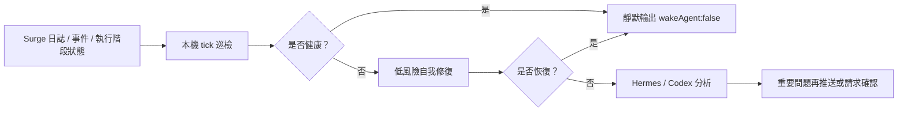

# Surge 守護助手

[简体中文](https://github.com/rexchen2024/surge-guardian-assistant/blob/main/README.md) | [English](https://github.com/rexchen2024/surge-guardian-assistant/blob/main/README.en.md)

面向 Surge 使用者的靜默巡檢和自我修復工具。它基於 Surge 官方 Agent Skill / `surge-cli` 的執行階段能力，持續檢查日誌、事件、策略和外部資源；健康時不打擾，異常時先自我修復，只有重要問題才交給 Hermes、Codex 或聊天工具繼續處理。

**目前版本：0.1.0**

本專案仍在初期測試階段，歡迎試用並提供回饋建議。後續會根據實際使用體驗持續更新。

## 目錄

- [亮點](#亮點)
- [工作方式](#工作方式)
- [安裝方式](#安裝方式)
- [文件](#文件)
- [專案資料](#專案資料)
- [我的推薦](#我的推薦)

---

## 亮點

- **極致靜默、低功耗**：健康巡檢只輸出 `{"wakeAgent": false}`，日常路徑走本機腳本和 Surge 執行階段介面，盡量不啟動 AI。
- **Surge 原生巡檢**：讀取事件、複測策略、刷新 DNS、更新外部資源、加入執行階段臨時規則。
- **安全自我修復優先**：低風險問題先自動處理；動作盡量小範圍、執行階段、可回復；永久設定、憑證、DNS 記錄、伺服器、MITM、Rewrite、Scripting、重載或重啟都需要確認。
- **必要時再用 AI**：重複、複雜或未恢復的問題才交給 Hermes/Codex；重要問題再透過聊天工具推送。
- **可持續沉澱**：Hermes 版本可利用 Hermes 的記憶和技能機制，把重複問題變成後續處理經驗。
- **自動更新、隱私優先**：可從 GitHub 拉取新版本；本機有改動不覆蓋；不自動上傳日誌或使用資料。

---

## 工作方式

---

## 安裝方式

**1. 極簡本機**

只想在本機終端檢查 Surge。最輕量，腳本直接呼叫 `surge-cli`，適合手動檢查或本機排程。

[一鍵安裝和本機執行說明](docs/runtime-options.zh-CN.md)

**2. 推薦 Hermes Agent ⭐**

常駐巡檢、異常通知、持續學習的首選方式。健康時完全靜默，重要問題再喚醒 AI，也可以透過聊天工具推送。

[一鍵安裝和 Hermes 任務說明](docs/hermes-edition.zh-CN.md)

**3. Codex 版本**

適合低頻檢查儲存庫、回顧異常、維護專案。不建議做每分鐘巡檢。

[一鍵安裝和 Codex 自動化說明](docs/codex-edition.zh-CN.md)

腳本直接呼叫 Surge 的 `surge-cli`。一鍵安裝、自動更新、任務頻率和安全邊界，都在對應說明裡。

---

## 文件

- [Hermes 版本](docs/hermes-edition.zh-CN.md)
- [Codex 版本](docs/codex-edition.zh-CN.md)
- [執行方式](docs/runtime-options.zh-CN.md)
- [升級](docs/updating.zh-CN.md)
- [自治模型](docs/autonomy.zh-CN.md)
- [故障排查](docs/troubleshooting.zh-CN.md)
- [常見問題](docs/faq.zh-CN.md)
- [隱私說明](docs/privacy.zh-CN.md)
- [更新日誌](CHANGELOG.zh-CN.md)

---

## 專案資料

- 授權條款：[MIT](LICENSE)
- 貢獻說明：[CONTRIBUTING.md](CONTRIBUTING.md)
- 安全策略：[SECURITY.md](SECURITY.md)
- 行為準則：[CODE_OF_CONDUCT.md](CODE_OF_CONDUCT.md)

---

## 我的推薦

[紅莓網路](https://cmy.homes/register?aff=4MMK4C)：用了多年的機場，即便是在特殊時期也高度可用，對 Clash 規則友好。
