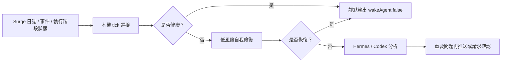

# Surge Sentry

[简体中文](https://github.com/rexchen1803/surge-sentry/blob/main/README.md) | [English](https://github.com/rexchen1803/surge-sentry/blob/main/README.en.md)

Surge Assistant 大框架下的 Cron 守護分支，面向 Surge 使用者做靜默巡檢和自我修復。它基於 Surge 官方執行階段能力和 `surge-cli`，持續檢查啟動情況、日誌、事件、策略、設定同步和流量風險；健康時不打擾，異常時先自我修復，只有重要問題才交給 Hermes、Codex 或聊天工具繼續處理。

**目前版本：0.2.0**

本專案仍在初期測試階段，歡迎試用並提供回饋建議。後續會根據實際使用體驗持續更新。

## 目錄

- [亮點](#亮點)
- [工作方式](#工作方式)
- [安裝方式](#安裝方式)
- [文件](#文件)
- [專案資料](#專案資料)

---

## 亮點

- **極致靜默、低功耗**：健康巡檢只輸出 `{"wakeAgent": false}`，日常路徑走本機腳本和 Surge 執行階段介面，盡量不啟動 AI。
- **Surge 原生巡檢**：讀取事件、複測策略、刷新 DNS、更新外部資源、加入執行階段臨時規則。
- **賽事/觀影流量監控**：可以讓 Sentry 盯一場 F1、世界盃 Fox 直播或 Apple TV 觀影，從開始、進行中到結束輸出清晰的實際流量報告。
- **安全自我修復優先**：低風險問題先自動處理；動作盡量小範圍、執行階段、可回復；永久設定、憑證、DNS 記錄、伺服器、MITM、Rewrite、Scripting、重載或重啟都需要確認。
- **任選 Hermes 或 Codex**：Hermes 路線適合常駐守護、低噪音通知和背景沉澱；Codex 路線適合開源使用者做安裝檢查、Surge 設定診斷、異常回顧、文件維護和安全變更協作。
- **必要時再用 AI**：重複、複雜或未恢復的問題才交給 Hermes/Codex；重要問題再透過聊天工具推送。
- **自動更新、隱私優先**：可從 GitHub 拉取新版本；本機有改動不覆蓋；不自動上傳日誌或使用資料。

---

## 工作方式

---

## 安裝方式

**1. 終端**

只想在本機終端檢查 Surge。最輕量，腳本直接呼叫 `surge-cli`，適合手動檢查或本機排程。

[一鍵安裝和本機執行說明](docs/runtime-options.zh-TW.md)

**2. Hermes Agent**

適合想要常駐背景守護的人。健康時完全靜默，重要問題再喚醒 AI，也可以透過聊天工具推送。

[一鍵安裝和 Hermes 任務說明](docs/hermes-edition.zh-TW.md)

**3. Codex**

適合想用開源專案和本機工作區管理 Surge Sentry 的人。Codex 擅長安裝檢查、Surge 設定診斷、流量監控解讀、異常回顧、隱私檢查、文件維護和安全改動建議；健康巡檢仍走本機腳本，避免每次檢查都啟動模型任務。

[一鍵安裝和 Codex 自動化說明](docs/codex-edition.zh-TW.md)

腳本直接呼叫 Surge 的 `surge-cli`。一鍵安裝、自動更新、任務頻率和安全邊界，都在對應說明裡。

---

## 文件

- [Hermes 版本](docs/hermes-edition.zh-TW.md)
- [Codex 版本](docs/codex-edition.zh-TW.md)
- [執行方式](docs/runtime-options.zh-TW.md)
- [升級](docs/updating.zh-TW.md)
- [自治模型](docs/autonomy.zh-TW.md)
- [故障排查](docs/troubleshooting.zh-TW.md)
- [常見問題](docs/faq.zh-TW.md)
- [隱私說明](docs/privacy.zh-TW.md)
- [更新日誌](CHANGELOG.zh-TW.md)

---

## 專案資料

- 授權條款：[MIT](LICENSE)
- 貢獻說明：[CONTRIBUTING.md](CONTRIBUTING.md)
- 安全策略：[SECURITY.md](SECURITY.md)
- 行為準則：[CODE_OF_CONDUCT.md](CODE_OF_CONDUCT.md)

---
